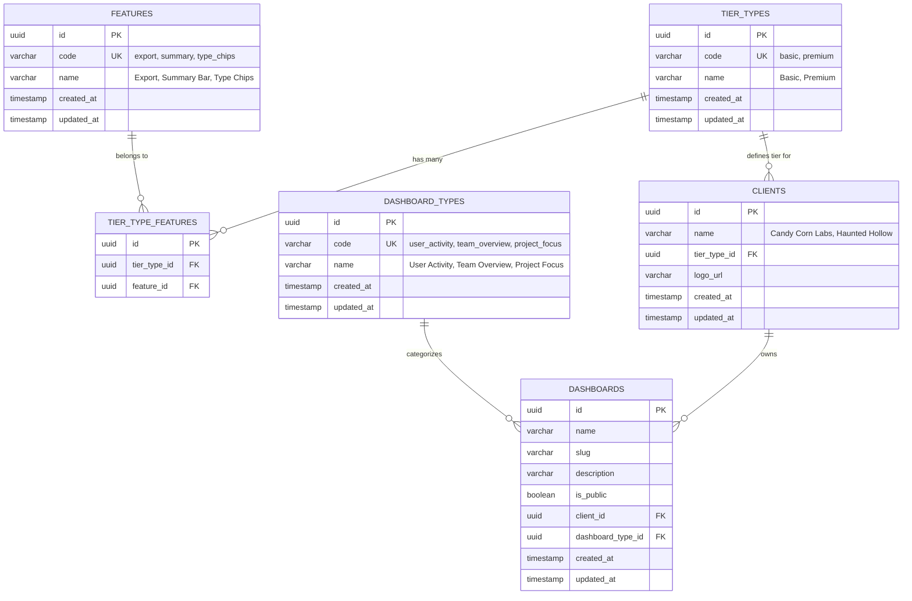

# Architecture: Database Schema - Client Tier System

## Client Tier System Database Relationships



## Key Relationships

### 1. **Tier Types → Features (Many-to-Many)**
- `tier_types` table defines available tiers (basic, premium)
- `features` table defines available features (export, summary, type_chips)
- `tier_type_features` join table determines which features each tier has access to

### 2. **Clients → Tier Types (Many-to-One)**
- Each client belongs to one tier type
- Tier type determines which features the client can access
- Example: "Candy Corn Labs" → "basic" tier, "Haunted Hollow" → "premium" tier

### 3. **Dashboards → Clients (Many-to-One)**
- Each dashboard belongs to one client
- Client's tier determines dashboard capabilities
- Example: Premium clients can create different dashboard types

### 4. **Dashboards → Dashboard Types (Many-to-One)**
- Dashboard types are premium features (user_activity, team_overview, project_focus)
- Basic clients only get user_activity dashboards
- Premium clients can choose from all dashboard types

## Data Flow

```
Client Selection → Tier Type → Available Features → Dashboard Capabilities
     ↓                ↓              ↓                    ↓
Candy Corn Labs → Basic Tier → Basic Features → User Activity Only
Haunted Hollow → Premium Tier → All Features → All Dashboard Types
```

## Sample Data

### Tier Types
- **Basic**: `code: 'basic'`, `name: 'Basic'`
- **Premium**: `code: 'premium'`, `name: 'Premium'`

### Features
- **Export**: `code: 'export'`, `name: 'Export'`
- **Summary**: `code: 'summary'`, `name: 'Summary Statistics Bar'`
- **Type Chips**: `code: 'type_chips'`, `name: 'Dashboard Type Selection Chips'`

### Clients
- **Candy Corn Labs**: `name: 'Candy Corn Labs'`, `tier_type_id: basic_tier_id`
- **Haunted Hollow**: `name: 'Haunted Hollow'`, `tier_type_id: premium_tier_id`

### Tier Type Features
- **Basic Tier**: No features (empty)
- **Premium Tier**: All features (export, summary, type_chips)
