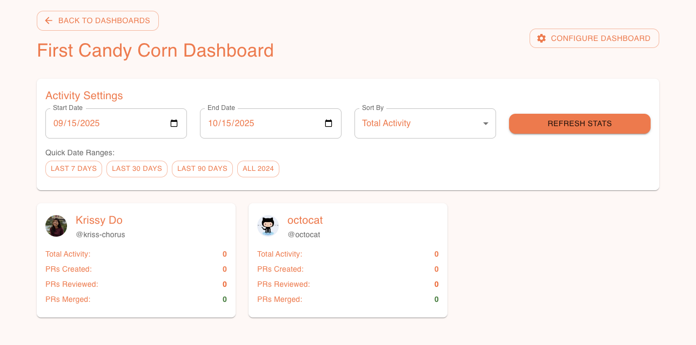
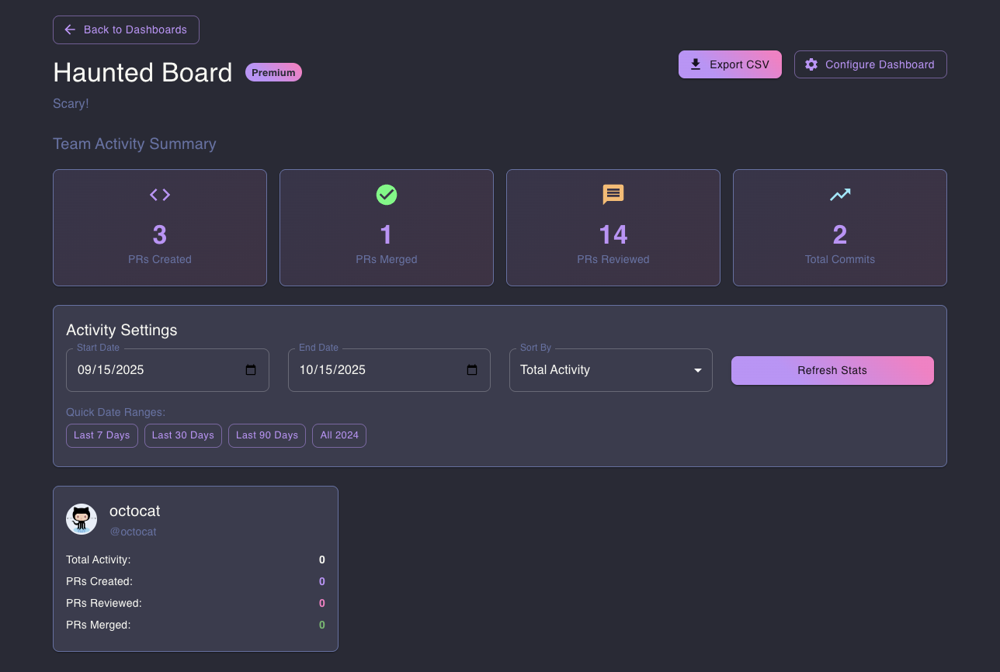
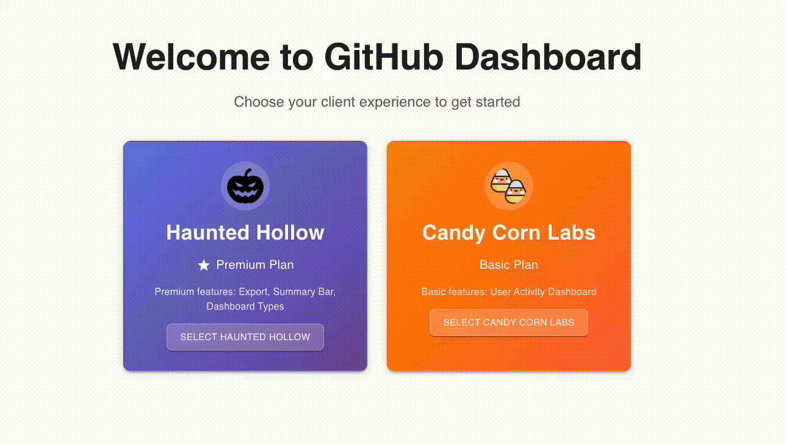

# GitHub Dashboard

A multi-tenant dashboard builder that tracks GitHub activity across users and repositories with tier-based client experiences.

## Features

### Client Tier System

**Basic Tier Dashboard**

_Coral orange theme with core dashboard functionality_

**Premium Tier Dashboard**

_Dracula dark theme with exclusive features_

**🎨 Dynamic Theme Switching**

_Theme transitions between Basic and Premium tiers_

### Premium Features

**📊 Dynamic Layout Switching**

_Three dashboard layouts: User Activity, Team Overview, Project Focus_

**📈 Summary Bar & Export**

- Aggregated team statistics
- CSV download functionality

### Feature Flag System

The application uses a **database-driven feature flag system** where:

- **Backend stores features** in `feature` and `tier_type_feature` tables
- **Frontend uses React Context** (`ClientContext`) to check feature availability
- **Three premium features** are controlled via feature flags:
  - `export` - CSV export functionality
  - `summary` - Summary statistics bar
  - `type_chips` - Dashboard type selection in configure modal

```typescript
// Feature checking in components
const { hasFeature } = useClientContext();
{
  hasFeature('export') && <ExportButton />;
}
{
  hasFeature('summary') && <SummaryBar />;
}
{
  hasFeature('type_chips') && <DashboardTypeSection />;
}
```

### Client Experience Architecture

**Backend (Database-Driven)**

- Client tiers stored in `tier_type` table (basic/premium)
- Features stored in `feature` table with codes: `export`, `summary`, `type_chips`
- Feature entitlements mapped in `tier_type_feature` table
- Premium tier gets all features, basic tier gets none

**Frontend (Context-Driven)**

- `ClientContext` fetches client data and features via GraphQL
- `hasFeature(featureCode)` function checks feature availability
- Theme determined by tier: Basic (coral) vs Premium (dracula)
- Components conditionally render based on feature flags

**No Authentication Required**

- Demo uses "Active Client" selector for tenant simulation
- Backend receives `X-Demo-Client-Id` header for multi-tenancy
- Perfect for showcasing tier-based experiences

### Core Functionality

- Multi-tenant client management
- Dashboard creation and configuration
- GitHub user and repository tracking
- Activity monitoring (PRs created, reviewed, merged)
- Responsive design for all devices

## Quick Start

From the nx-sandbox repo root:

```bash
# Start the entire stack
pnpm run tilt:up:github-dashboard

# Or run individual services
pnpm nx serve github-dashboard-api
pnpm nx serve github-dashboard-web
```

### Environment

Create `.env` at repo root:

```
GITHUB_TOKEN=ghp_xxx   # Optional: for GitHub API access
```

### Demo Flow

1. **Select Client**: Choose between Basic (Candy Corn Labs) or Premium (Haunted Hollow)
2. **Create Dashboard**: Add users, repositories, and configure activity tracking
3. **View Activity**: Monitor PR activity with different layouts (Premium only)
4. **Export Data**: Download CSV reports (Premium only)

## Architecture

### Tech Stack

- **Frontend**: React + TypeScript + MUI + Vite
- **Backend**: NestJS + PostGraphile + PostgreSQL
- **Database**: PostgreSQL with Drizzle ORM
- **GraphQL**: PostGraphile auto-generated API
- **Theming**: MUI theme system with tier-based styling (Basic: coral, Premium: dracula)

### Key Components

- **ClientContext**: Global state management for client selection and premium features
- **DashboardLayouts**: Dynamic layout switching based on dashboard type
- **ThemeFactory**: MUI theme factory with tier-based themes (neutral, basic, premium)
- **ActivityConfigs**: Configurable activity tracking (PRs created, reviewed, merged)

## Testing

### E2E Tests

```bash
# Run API e2e tests
NODE_OPTIONS="--require $(pwd)/packages/github-dashboard/api-e2e/src/support/register-nock.js" pnpm nx run api-e2e:e2e

# Run Web e2e tests
pnpm nx run web-e2e:e2e

# Run all tests
pnpm nx run-many --target=e2e --projects=api-e2e,web-e2e
```

### Test Coverage

- Dashboard CRUD operations
- Client tier system and premium features
- User and repository management
- Activity tracking and configuration
- Responsive design and UI interactions
- Full stack integration workflows

## Documentation

- **[Client Experiences Guide](../../docs/02-demo-client-experiences.md)** - Complete implementation details
- **[Database Schema](../../docs/architecture-database-schema.md)** - Data model and relationships
